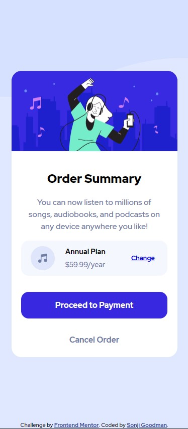
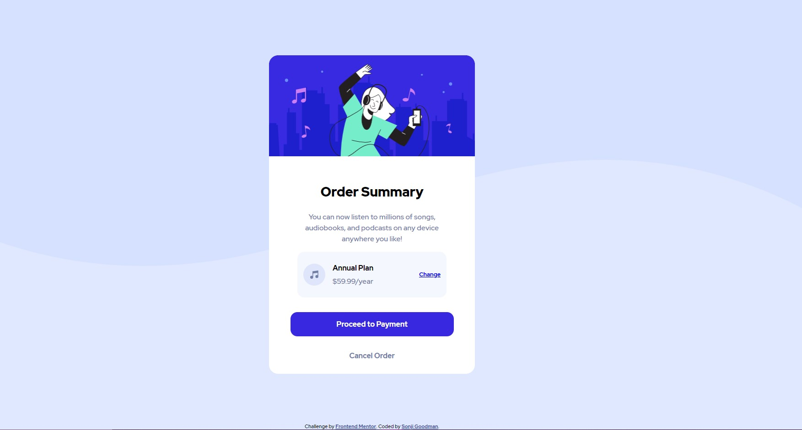

# Frontend Mentor - Order summary card solution

This is a solution to the [Order summary card challenge on Frontend Mentor](https://www.frontendmentor.io/challenges/order-summary-component-QlPmajDUj). Frontend Mentor challenges help you improve your coding skills by building realistic projects. 

## Table of contents

- [Frontend Mentor - Order summary card solution](#frontend-mentor---order-summary-card-solution)
  - [Table of contents](#table-of-contents)
  - [Overview](#overview)
    - [The challenge](#the-challenge)
    - [Screenshot](#screenshot)
      - [Mobile](#mobile)
      - [Desktop](#desktop)
    - [Links](#links)
  - [My process](#my-process)
    - [Built with](#built-with)
    - [What I learned](#what-i-learned)
    - [Continued development](#continued-development)
    - [Useful resources](#useful-resources)
  - [Author](#author)

## Overview

### The challenge

Users should be able to:

- See hover states for interactive elements

### Screenshot

#### Mobile

#### Desktop

### Links

- Solution URL: [https://www.frontendmentor.io/solutions/order-summary-card-html-css-css-flexbox-GjoNIsxSS](https://www.frontendmentor.io/solutions/order-summary-card-html-css-css-flexbox-GjoNIsxSS)
- Live Site URL: [http://Infinity-Mineeva.github.io/Order-Summary-Card/](http://Infinity-Mineeva.github.io/Order-Summary-Card/)

## My process

Opened the provided Design images in the `design` folder in Figma to just get an idea of what the dimensions for each of the elements were.

After that, tried to match the, as best as I could in HTML/CSS.

### Built with

- Semantic HTML5 markup
- CSS custom properties
- Flexbox
- Mobile-first workflow

### What I learned

This was more of a review for me, as I utilized tools that I was familiar with (mainly Flexbox).

### Continued development

I like working with Flexbox, so in the future I'll take a shot at using CSS Grid instead.

### Useful resources

- [CSS Flexbox](https://www.w3schools.com/css/css3_flexbox.asp) - served as a lovely refersher for the basics of Flexbox. Definitely recommend for anyone.

## Author

Thanks for checking out this project! 😃 You can find my profiles at these sites:

- [Personal Portfolio](www.sonjigoodman.com)
- [Twitter: @IT_Sonji](https://twitter.com/sonji_it)
- [Frontend Mentor - @infinity-Mineeva](https://www.frontendmentor.io/profile/Infinity-Mineeva)

